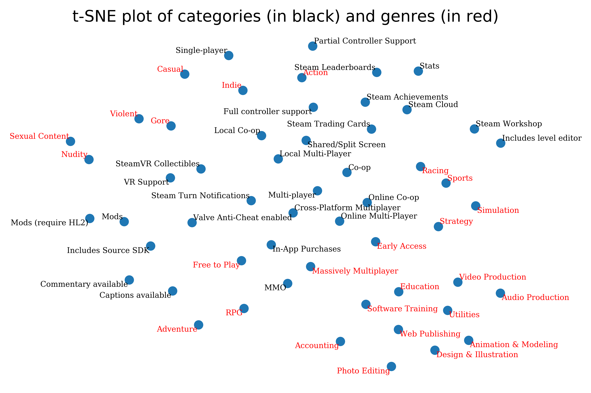

# Steam API [![Build status][Build image]][Build] [![Updates][Dependency image]][PyUp] [![Python 3][Python3 image]][PyUp] [![Code coverage][Codecov image]][Codecov]

  [Build]: https://travis-ci.org/woctezuma/steam-api
  [Build image]: https://travis-ci.org/woctezuma/steam-api.svg?branch=master

  [PyUp]: https://pyup.io/repos/github/woctezuma/steam-api/
  [Dependency image]: https://pyup.io/repos/github/woctezuma/steam-api/shield.svg
  [Python3 image]: https://pyup.io/repos/github/woctezuma/steam-api/python-3-shield.svg

  [Codecov]: https://codecov.io/gh/woctezuma/steam-api
  [Codecov image]: https://codecov.io/gh/woctezuma/steam-api/branch/master/graph/badge.svg

This repository contains Python code to download data through Steam API.

Data is available as a snapshot in [another repository](https://github.com/woctezuma/steam-api-data).

Outputs for each Steam store attribute can be found in [`plots/`](plots/). Confidence intervals can be found in [`plots_with_confidence_interval/`](plots_with_confidence_interval/).

Outputs for each categorie and genre can be found in [`plots_categories_and_genres/`](plots_categories_and_genres/). Confidence intervals can be found in [`plots_categories_and_genres_with_confidence_interval/`](plots_categories_and_genres_with_confidence_interval/).

If you like these stats, [check out my other repository](https://github.com/woctezuma/humble-monthly) with a focus on Humble Monthly bundles.
